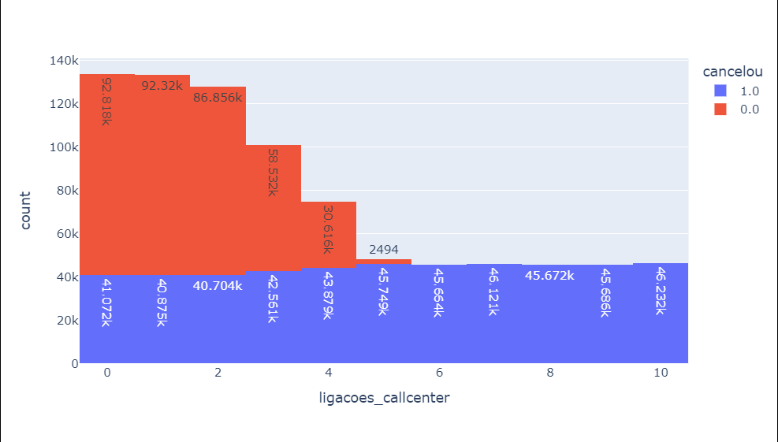
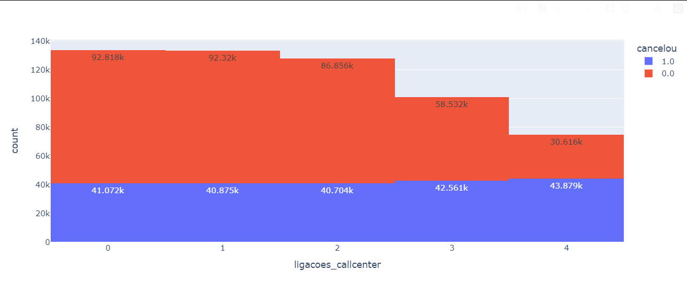
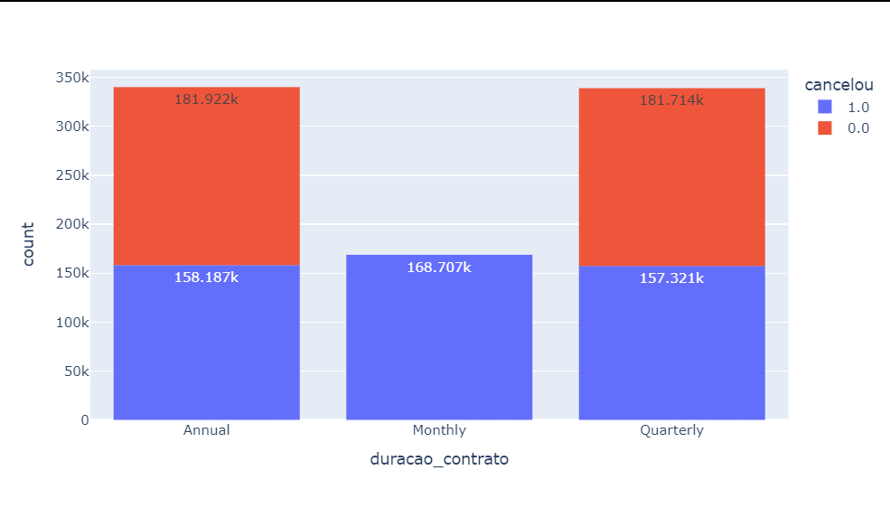

# Python Insights # PROJETO PYTHON INSIGHTS - ANÁLISE EXPLORATÓRIA 

## BASE DE CANCELAMENTOS E INADIMPLENTES/ 800 MIL CLIENTE 

## Introdução
Neste projeto, **Python Insights**, eu quis trazer um modelo real de empresas de **streaming de música**, **plataforma de educação e cursos**, **telecomunicações**, que se valem de serviço de *assinatura* para entender os principais motivos como **comportamento de churn** e também de inadimplência para entender o que levam clientes a cancelarem serviços em empresas de modelo de assinatura, como:

- Streaming de música e vídeo (Spotify, Netflix)
- SaaS e plataformas de cursos
- Operadoras de telecomunicação
- Clubes de assinatura
- Fintechs e apps com cobrança recorrente

  Não é ficção. É exatamente o que está acontecendo com empresas que ignoram os sinais de alerta escondidos em seus próprios dados! 📊


Neste projeto, mostro um cenário real de como realizar uma análise exploratória de dados (EDA) com Python para descobrir na prática sobre o comportamento de clientes em contratos mensais, padrões de cancelamento, canais de atendimento, formas de pagamento, padrões de inadimplência e outros fatores relacionados ao projeto usando uma base fictícia de ~800 mil clientes.


## 🎯 Objetivos do Projeto

- Identificar padrões e comportamentos relacionados ao churn
- Explorar visualmente os dados para gerar hipóteses estratégicas
- Fornecer sugestões práticas para retenção de clientes
- Demonstrar o uso de Python para tomada de decisões orientadas a dados

---

## 🧠 Passo a Passo


#passo a passo em português 
#Passo 1: Importar a base de dados 
#Passo 2: Visualizar a base de dados (2 objetivos -> entender as informações + encontrar problemas)
#Passo 3: Resolver os problemas da base de dados (excluir colunas, preencher valores nulos, etc)
#Passo 4: Análise Inicial (quantos clientes cancelaram, qual o % de clientes)
#Passo 5: Análise a causa dos cancelamentos dos clientes 

---

## 🛠️ Tecnologias Utilizadas

- **Python 3**
- **Pandas** — manipulação e análise de dados
- **Plotly Express** — visualizações interativas
- **Jupyter Notebook** — desenvolvimento e documentação do processo
- **VS Code** - ambiente de desenvolvimento
---

## 📁 Estrutura do Projeto

```
📦 projeto-cancelamentos
├── 📄 README.md
├── 📊 EDA_Cancelamentos_Assinaturas.ipynb
├── 📂 dados
│   └── cancelamentos.csv
```

---


1. **Configuração do Ambiente** 
    Instalação das bibliotecas pandas e plotly
    Remoção de colunas inúteis (customerID)Verificação de tipos e valores nulos
    Uso de .dropna() para limpar a base
    
    ```bash
    pip install pandas plotly
    ```

2. **Preparando o Terreno**  
    abrimos um notebook Jupyter (.ipynb) e importar um arquivo chamado cancelamentos.csv, que contém colunas como:
    
    Tempo de contrato

    Dias de Atraso *(aging - adimplência)*

    Idade

    Gênero

    Número de ligações ao call center

    Método de pagamento

    Status de cancelamento *(1 = cancelou, 0 = não cancelou)*


3. **Tratamento dos Dados**  
    Antes de qualquer análise profunda, precisamos garantir que nossos dados estão limpos e prontos para revelar seus segredos.

    Remoção de colunas inúteis (customerID) com .drop()

    Verificação de tipos e valores nulos em .info()

    Uso de .dropna() para limpar a base em transformar em dados válidos.


4. **Primeira descoberta: a taxa de cancelamento**  
    Com value_counts(normalize=True), descobrimos que **56% dos clientes** estavam cancelando. Um número assustador — e perfeito para começar a investigar as causas.
```
cancelou
1.0    499993 (56,7%)
0.0    381666 (43,3%)
```

## 🔍 Principais Insights - CSI dos Dados - Investigação Profunda de Causas

- 📞Clientes que ligaram mais de **3 vezes ao call center** mostraram maior risco de churn.
- **Inadimplência superior a 20 dias**, ou seja a taxa de aging foi associada a uma maior propensão ao cancelamento.
- 🧾Clientes com **contratos mensais** apresentaram alta taxa de cancelamento. Mensal x Anual — quem fica mais?
- Idade e gênero **não mostraram correlações significativas** com o churn.

```
cancelou
0.0    0.633324
1.0    0.366676
```



```
cancelou
0.0    0.73128
1.0    0.26872
```


```
cancelou
0.0    0.816301
1.0    0.183699
```



---


## 🧩 Resultados
A partir dessa análise exploratória, surgiram insights estratégicos valiosos:

>Call Center como sinal de alerta: Implementar um sistema de alerta quando um cliente faz mais de 3 ligações no mês.

>Plano Anual com desconto: Oferecer upgrade com bônus para clientes mensais.

>Intervenção antecipada: Abordar clientes inadimplentes antes do **20º dia de atraso**.

## Conclusão
Se você tem uma empresa baseada em recorrência — como plataformas de streaming, academias, fintechs, serviços de SaaS, clubes de assinatura ou operadoras de telefonia — uma análise exploratória como essa pode reduzir o churn drasticamente de **56,7% para 18%** e impulsionar a retenção de clientes.

Muitas vezes, as respostas para os maiores desafios do seu negócio já estão escondidas nos dados que você possui. Você só precisa saber como extraí-las!


## 📬 Contato

Quer aplicar esse tipo de análise nos dados da sua empresa ou conhecer mais sobre o projeto?  
Entre em contato comigo pelo [LinkedIn](https://www.linkedin.com/in/elenjohann/) ou abra uma issue aqui no repositório!

---

## ⭐️ Créditos

Este projeto foi inspirado e desenvolvido como parte da **Jornada Python**, focado em capacitar profissionais de dados a resolver problemas reais de negócio.
